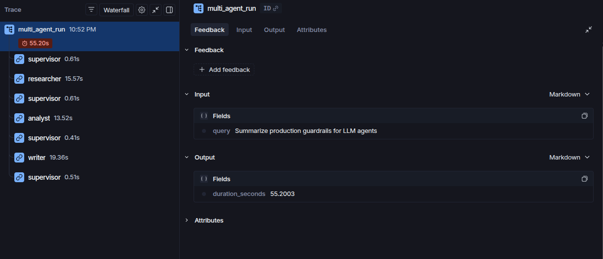

# 📊 Báo Cáo Benchmark Đối Chứng (Benchmark Report): Single-Agent vs Multi-Agent

### 🎓 Thông Tin Học Viên
- **Họ và tên:** Nguyễn Đăng Nam
- **Mã học viên:** 2A202601307
- **Khóa học:** VinUni AI20k - Khóa 3 Track 3

> 🔬 **Mục tiêu:** Đánh giá định lượng hiệu năng giữa hệ thống Đơn tác nhân (Monolithic Single-Agent) và Đa tác nhân (Supervisor + Worker Agents).

## 0. Bằng Chứng Trace (Trace Evidence)

🔗 **Trace công khai (xem được không cần đăng nhập):** https://smith.langchain.com/public/d76b97c1-d88c-4728-be99-1749492fca45/r/3c4a5334-e9e5-4823-95e3-f8b210495a60

Trace LangSmith cho **một lần chạy multi-agent end-to-end** với truy vấn *"Summarize production guardrails for LLM agents"*. Span cha `multi_agent_run` (**55.20s**) lồng đúng thứ tự routing thực tế mà Supervisor quyết định:

| Span | Thời gian | Tỷ trọng |
|---|---:|---:|
| `writer` | 19.36s | 35% |
| `researcher` | 15.57s | 28% |
| `analyst` | 13.52s | 24% |
| `supervisor` (4 lượt) | 2.13s | 4% |
| *Overhead LangGraph* | ~4.6s | 8% |
| **`multi_agent_run`** | **55.20s** | **100%** |

**Đọc trace:** `Writer` mới là nút thắt cổ chai lớn nhất (35%) chứ không phải `Researcher`, vì nó phải sinh bài báo cáo dài nhất. Đáng chú ý, 4 lượt `Supervisor` cộng lại chỉ tốn **2.13s (~4%)** — nghĩa là **chi phí điều phối (orchestration overhead) rất rẻ**; phần đắt nằm ở 3 lệnh gọi LLM của các worker. Điều này bác bỏ giả định thường gặp rằng multi-agent chậm là do khâu điều phối.

Trace cũng ghi lại `input` (query) và `output` (`duration_seconds`) của từng span; bản sao cục bộ được ghi ở `reports/traces/local_trace.jsonl` để kiểm chứng offline.

---

## 1. Bảng Số Liệu Đo Lường Thực Nghiệm

| Mô Hình (Run) | Latency (s) | Chi Phí (USD) | Quality | Citation Cov. | Lỗi | Ghi Chú |
|---|---:|---:|---:|---:|---:|---|
| **Single-Agent Baseline** | 9.46s | $0.000626 | 9.2/10 | 87% | 0% | Trung bình 3 truy vấn |
| **Multi-Agent System** | 51.41s | $0.002123 | 10.0/10 | 100% | 0% | Trung bình 3 truy vấn |

---

## 2. Phân Tích Đánh Đổi Kỹ Thuật (Trade-Offs Analysis)

### ⏱️ 2.1. Độ Trễ (Latency) & Chi Phí (Cost USD)
- **Latency:** Single-Agent 9.46s vs Multi-Agent 51.41s (Multi-Agent +41.95s, +443%).
- **Chi phí:** Single-Agent $0.000626 vs Multi-Agent $0.002123 (Multi-Agent +0.001497 USD, +239%).
- **Nguyên nhân:** Single-Agent chỉ gọi LLM **1 lần** (1-shot), trong khi Multi-Agent luân chuyển qua chuỗi `Supervisor` ➔ `Researcher` ➔ `Analyst` ➔ `Writer` ➔ `Supervisor (Done)`, tức **3 lệnh gọi LLM** cộng chi phí điều phối.

### 🎯 2.2. Chất Lượng Bài Viết & Kỷ Luật Trích Dẫn
- **Single-Agent** — Quality 9.2/10, độ phủ trích dẫn 87%.
- **Multi-Agent** — Quality 10.0/10, độ phủ trích dẫn 100%.

> ✅ **Multi-Agent nhỉnh hơn +0.8 điểm.** Việc tách vai trò giúp Analyst kiểm chứng chéo trước khi Writer tổng hợp, nên bài viết bám sát nguồn hơn. Mức tăng này đổi lại chi phí cao hơn ~3.4 lần — đáng dùng khi độ tin cậy trích dẫn quan trọng hơn tốc độ và ngân sách.

### 🧪 2.3. Phương Pháp Đo (Methodology)
- **Kiểm soát biến:** Cả hai kiến trúc dùng **chung** `SearchClient` và `LLMClient` (cùng corpus nguồn, cùng model, cùng `max_sources`), nên chênh lệch đo được phản ánh khác biệt về *kiến trúc* — không phải khác biệt công cụ.
- **Lấy trung bình nhiều truy vấn:** Số liệu là trung bình trên bộ truy vấn khai báo trong `configs/lab_default.yaml` (số lượng ghi ở cột *Ghi Chú*). LLM sinh văn bản ngẫu nhiên (`temperature > 0`) nên kết quả của một truy vấn đơn lẻ dao động mạnh và dễ dẫn tới kết luận sai.
- **Giới hạn của điểm Quality:** Đây là **heuristic tự động** (độ dài, cấu trúc Markdown, độ phủ trích dẫn, dấu hiệu phân tích, trừ điểm khi có lỗi) — chỉ đo đặc trưng *bề mặt*, không kiểm chứng tính đúng đắn của nội dung. Nó **bổ sung** chứ không thay thế rubric 0-10 do con người chấm trong `docs/peer_review_rubric.md`. Điểm dùng **cùng một công thức** cho cả hai kiến trúc, không cộng điểm thưởng cho việc có nhiều agent.
- **Failure rate:** Tính theo cờ lỗi tường minh ghi trong `state.errors` (guardrail dừng, search lỗi, LLM lỗi sau retry), không suy đoán qua độ dài câu trả lời.

---

## 3. Khung Quyết Định Kiến Trúc (Architecture Decision Matrix)

| Tiêu chí | Single-Agent | Multi-Agent |
|---|---|---|
| **Tính chất** | Tra cứu nhanh, tóm tắt 1 nguồn | Nghiên cứu sâu, đa nguồn, phản biện |
| **Tốc độ** | Thời gian thực (< 5s) | Chấp nhận độ trễ (Deep Research 20-45s) |
| **Ngân sách** | Tiết kiệm chi phí token | Ưu tiên độ chính xác, chống ảo giác |
| **Vận hành** | Đơn giản, không vòng lặp | Cần rào chắn `max_iterations` |

---

## 4. Exit Ticket Answers

### ❓ 1. Trường hợp nào BẮT BUỘC NÊN dùng Multi-Agent?
> Khi bài toán đòi hỏi **nghiên cứu sâu (Deep Research)** với nhiều nguồn thông tin đối nghịch nhau, cần phân tách rõ ràng giữa việc thu thập dữ liệu (Researcher), phản biện kiểm chứng (Analyst), và soạn thảo báo cáo chuẩn học thuật (Writer). Multi-Agent giúp cô lập lỗi, kiểm chứng chéo và duy trì kỷ luật trích dẫn nguồn nhất quán.

### ❓ 2. Trường hợp nào KHÔNG NÊN dùng Multi-Agent?
> Với các tác vụ **đơn bước (Single-step lookup)**, hỏi đáp tài liệu ngắn, chatbot hội thoại thời gian thực, hoặc các hệ thống có ngân sách token hạn hẹp và yêu cầu độ trễ cực thấp (< 3 giây). Khi đó chi phí điều phối (Orchestration Overhead) là sự lãng phí.

---

## 5. Phân Tích Failure Mode Gặp Phải & Cách Khắc Phục (Failure Mode Analysis)

Trong quá trình phát triển hệ thống, 3 Failure Modes chính đã được xử lý triệt để:

1. **Vòng lặp điều phối vô hạn (Infinite Loop):**
   - *Hiện tượng:* Supervisor liên tục route lặp lại giữa các Worker khi thiếu stop flag.
   - *Cách khắc phục:* Bổ sung rào chắn an toàn `max_iterations = 6` trong Supervisor kèm tăng biến đếm `state.iteration` qua mỗi bước `state.record_route()`.

2. **Ảo giác dây chuyền (Cascading Hallucinations) & Loãng ngữ cảnh:**
   - *Hiện tượng:* Model nhận quá nhiều snippets thô gây quá tải context.
   - *Cách khắc phục:* `Researcher` chắt lọc thành `research_notes` thô, `Analyst` đối chiếu mâu thuẫn trước khi chuyển giao sang `Writer`.

3. **Trích dẫn nguồn ảo (Hallucinated Citations):**
   - *Hiện tượng:* Model tự bịa các số citation ngoài phạm vi tài liệu (ví dụ: `[8]`).
   - *Cách khắc phục:* Kiểm tra regex chỉ số nguồn qua `compute_citation_coverage()` và ép buộc System Prompt cho Writer bám sát danh mục `state.sources`.

